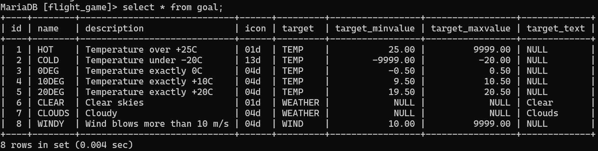
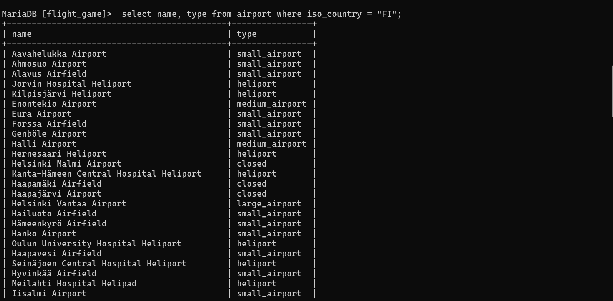
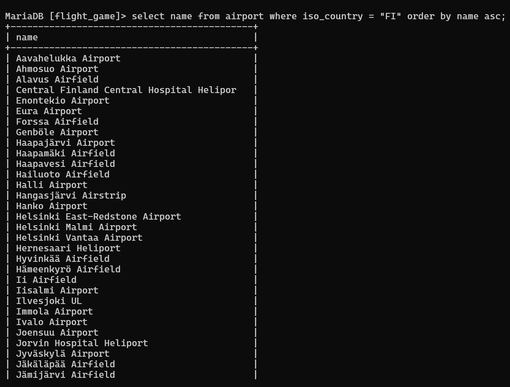
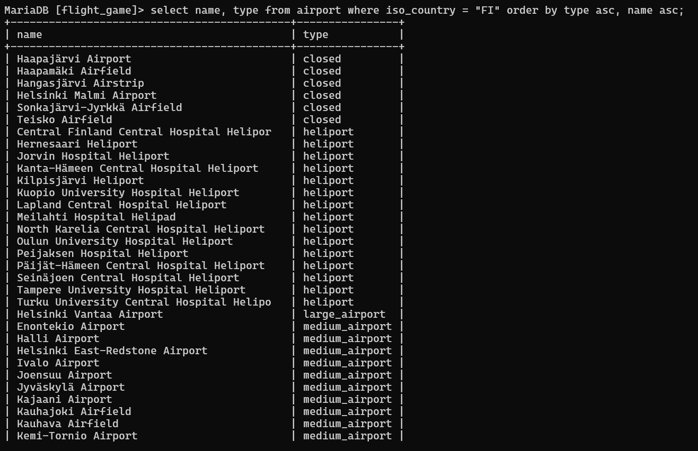
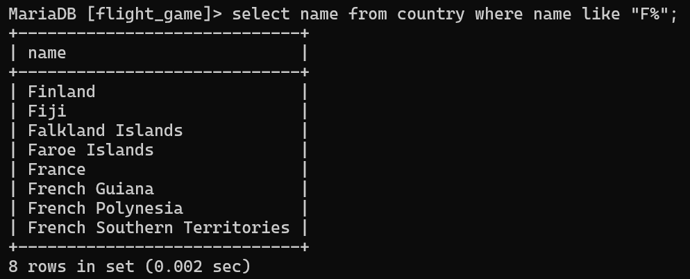
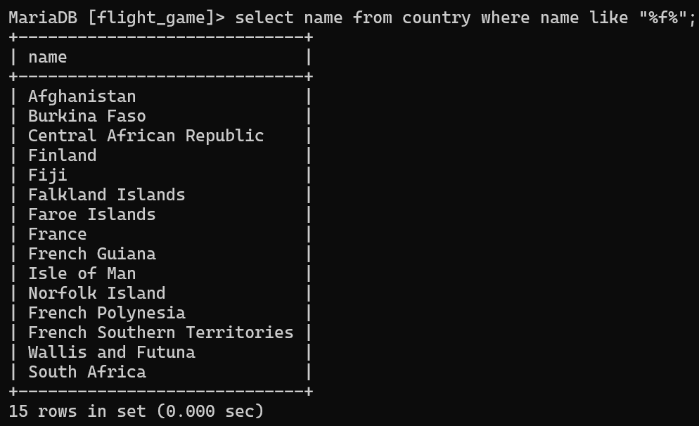
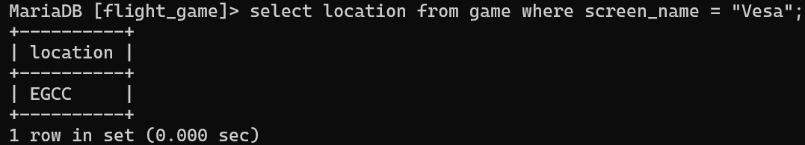
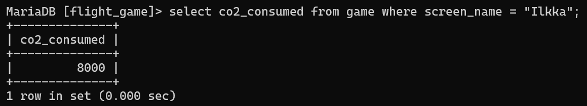
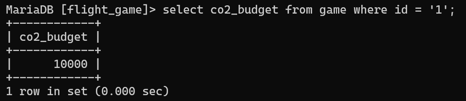
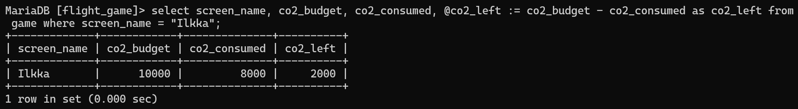

# Exercise 2

## Assignment 1
```sql
SELECT * FROM goal;
```



## Assignment 2
```sql
SELECT name, type FROM airport where iso_country = "FI";
```



## Assignment 3
```sql
SELECT name FROM airport where iso_country = "FI" order by name asc;
```



## Assignment 4
```sql
SELECT name, type FROM airport where iso_country = "FI" order by type asc, name asc;
```



## Assignment 5
```sql
SELECT name FROM country where name like "F%";
```



## Assignment 6
```sql
SELECT name FROM country where name like "%F%";
```



## Assignment 7
```sql
SELECT location FROM game where screen_name = "Vesa";
```



## Assignment 8
```sql
SELECT co2_consumed FROM game where screen_name = "Ilkka";
```



## Assignment 9
```sql
SELECT co2_budget FROM game where id = '1';
```



## Assignment 10
```sql
SELECT screen_name, co2_budget, co2_consumed,
@co2_left := co2_budget - co2_consumed AS co2_left 
FROM game WHERE screen_name = "Ilkka";
```


