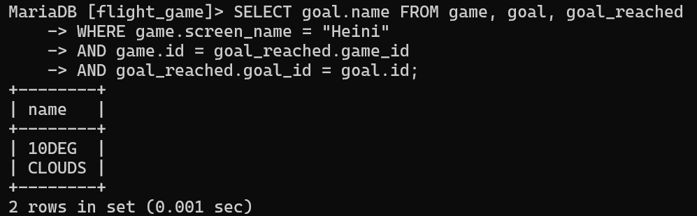

# Exercise 3

## Assignment 1
```sql
SELECT country.name AS 'country name',
airport.name AS 'airport name'
FROM country, airport
WHERE country.iso_country = airport.iso_country
AND country.name = 'Iceland';
```


## Assignment 2
```sql
SELECT airport.name AS 'airport name' FROM airport, country
WHERE type = 'large_airport'
AND airport.iso_country = country.iso_country
AND country.name = 'France';
```


## Assignment 3

```sql
SELECT country.name AS 'country name', 
        airport.name AS 'airport name' FROM country, airport
WHERE country.iso_country = airport.iso_country
AND country.continent = 'AN';
```


## Assignment 4
```sql
SELECT elevation_ft FROM game, airport
WHERE game.screen_name = 'Heini'
AND airport.ident = game.location;
```


## Assignment 5
```sql
SELECT @elevation_m := airport.elevation_ft * 0.3048 as elevation_m
FROM game, airport
WHERE game.screen_name = 'Heini'
AND airport.ident = game.location;
```


## Assignment 6
```sql
SELECT name FROM airport, game
WHERE game.screen_name = 'Ilkka'
AND game.location = airport.ident;
```


## Assignment 7
```sql
SELECT country.name FROM game, airport, country
WHERE game.screen_name = 'Ilkka'
AND game.location = airport.ident
AND airport.iso_country = country.iso_country;
```


## Assignment 8
```sql
SELECT goal.name FROM game, goal, goal_reached
WHERE game.screen_name = 'Heini'
AND game.id = goal_reached.game_id
AND goal_reached.goal_id = goal.id;
```



## Assignment 9
```sql
SELECT airport.name FROM game, goal, goal_reached, airport
WHERE game.screen_name = 'Ilkka'
AND game.id = goal_reached.game_id
AND goal_reached.goal_id = goal.id
AND goal.name = 'Clouds'
AND game.location = airport.ident;
```


## Assignment 10
```sql
SELECT country.name FROM game, goal,
goal_reached, airport, country
WHERE game.screen_name = "Ilkka"
AND game.id = goal_reached.game_id
AND goal_reached.goal_id = goal.id
AND goal.name = 'Clouds'
AND game.location = airport.ident
AND airport.iso_country = country.iso_country; 
```

