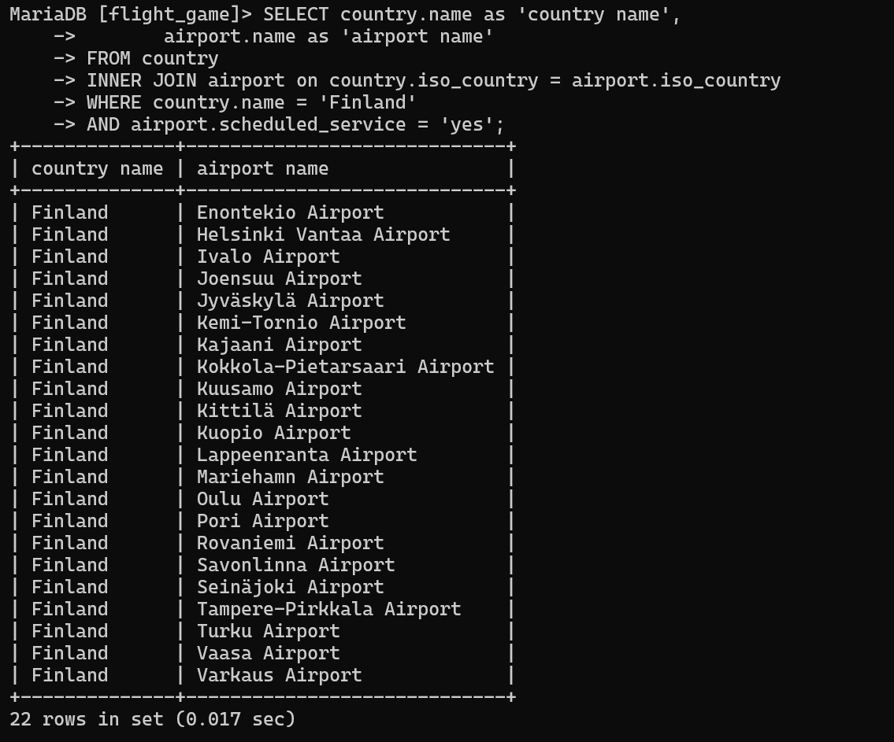
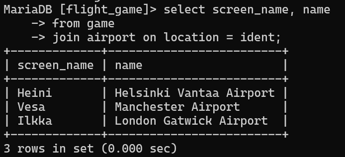
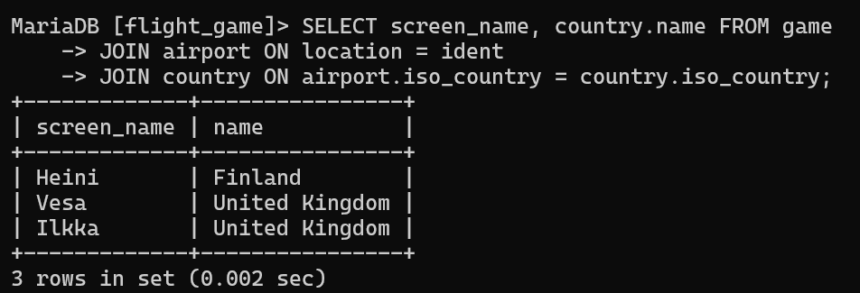
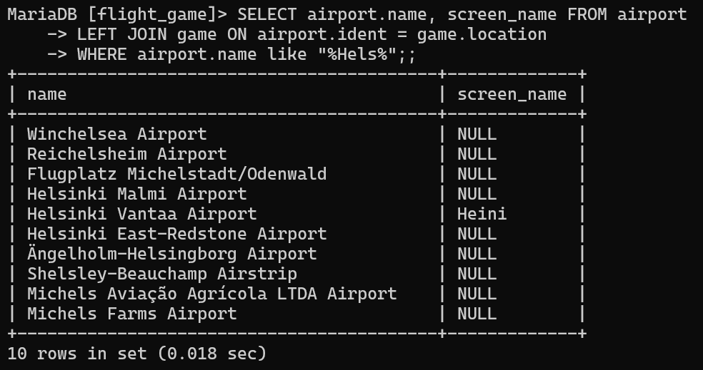
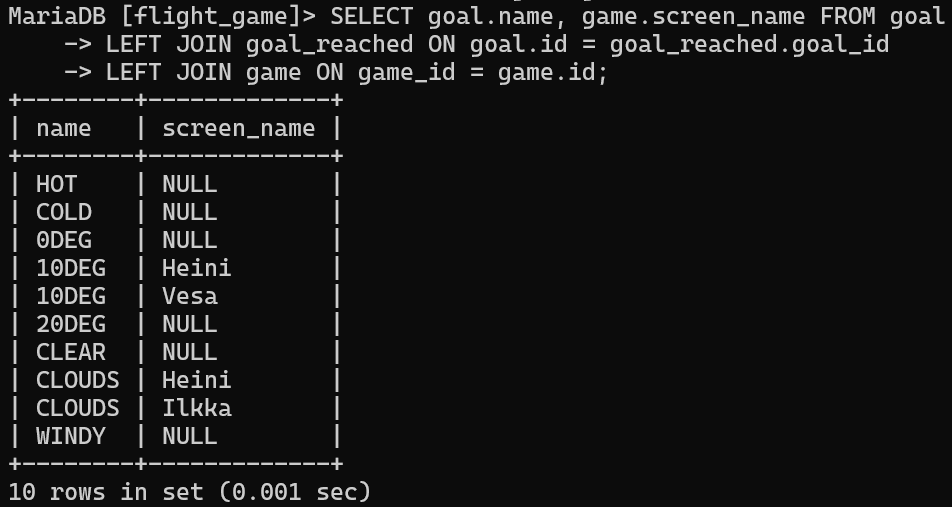

# Week 4

## Assignment 1

```sql
SELECT country.name as 'country name',
       airport.name as 'airport name' FROM country
INNER JOIN airport on country.iso_country = airport.iso_country
WHERE country.name = 'Finland' 
AND airport.scheduled_service = 'yes';
```



## Assignment 2
```sql
SELECT screen_name, name FROM game
JOIN airport ON location = ident;
```



## Assignment 3
```sql
SELECT screen_name, country.name FROM game
JOIN airport ON location = ident
JOIN country ON airport.iso_country = country.iso_country;
```



## Assignment 4
```sql
SELECT airport.name, screen_name FROM airport
LEFT JOIN game ON airport.ident = game.location
WHERE airport.name like "%Hels%";
```



## Assignment 5
```sql
SELECT goal.name, game.screen_name FROM goal
LEFT JOIN goal_reached ON goal.id = goal_reached.goal_id
LEFT JOIN game ON game_id = game.id;
```


