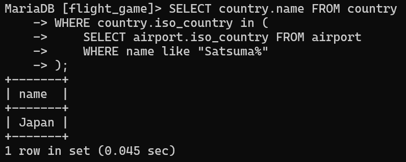
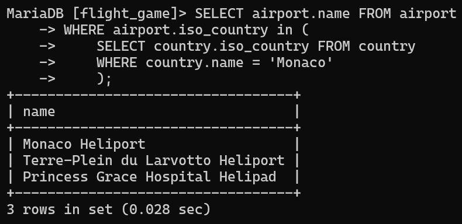
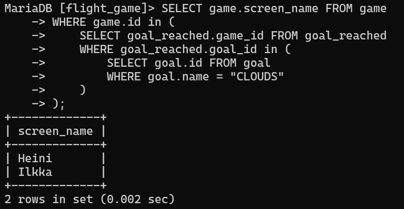
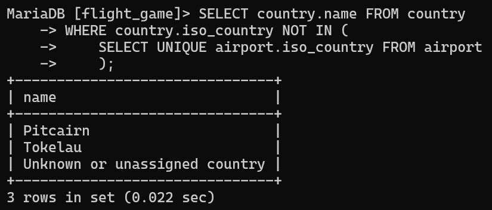

# Exercise 5

## Assignment 1 

```sql
SELECT country.name FROM country
WHERE country.iso_country in (
    SELECT airport.iso_country FROM airport
    WHERE name like 'Satsuma%'
);
```



## Assignment 2
```sql
SELECT airport.name FROM airport
WHERE airport.iso_country IN (
    SELECT country.iso_country FROM country
    WHERE country.name = 'Monaco'
    );
```



## Assignment 3
```sql
SELECT game.screen_name FROM game
WHERE game.id in (
    SELECT goal_reached.game_id FROM goal_reached
    WHERE goal_reached.goal_id in (
        SELECT goal.id FROM goal
        WHERE goal.name = 'CLOUDS'
    )
);
```



## Assignment 4

```sql
SELECT country.name FROM country
WHERE country.iso_country NOT IN (
    SELECT UNIQUE airport.iso_country FROM airport
    );
```



## Assignment 5

```sql
SELECT goal.name FROM goal
WHERE goal.id NOT IN (
    SELECT goal_reached.goal_id FROM goal_reached
    WHERE goal_reached.game_id IN (
        SELECT game.id FROM game
        WHERE game.screen_name = 'Heini'
        )
    );
```