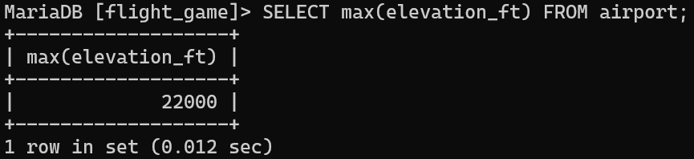
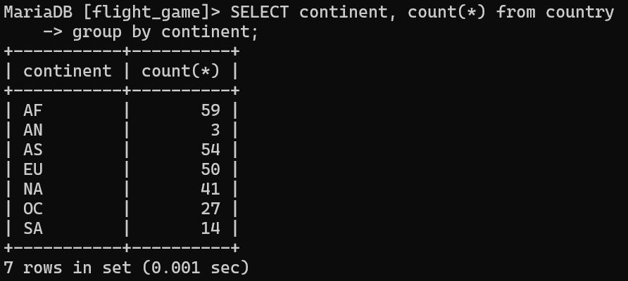
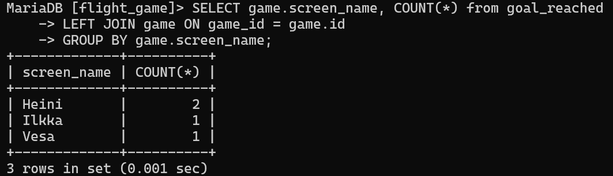
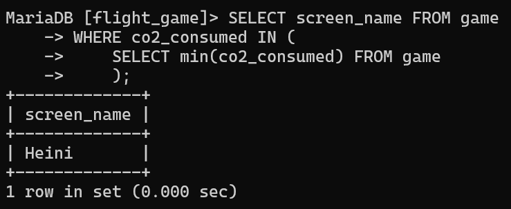
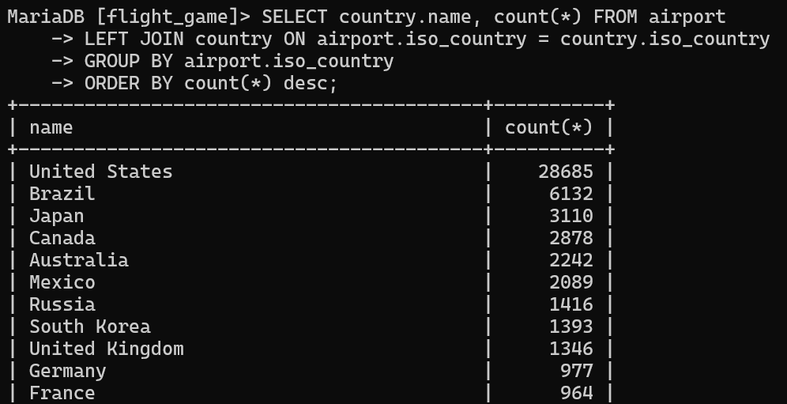
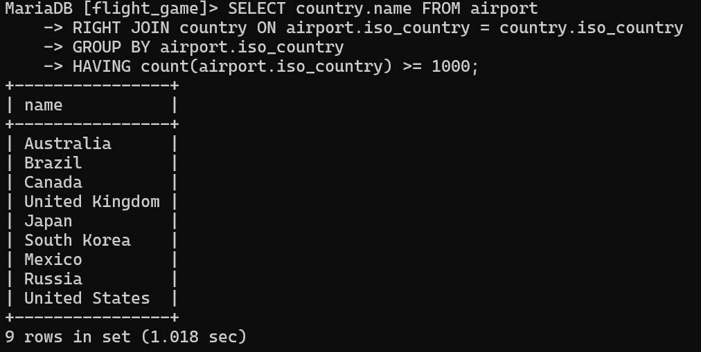
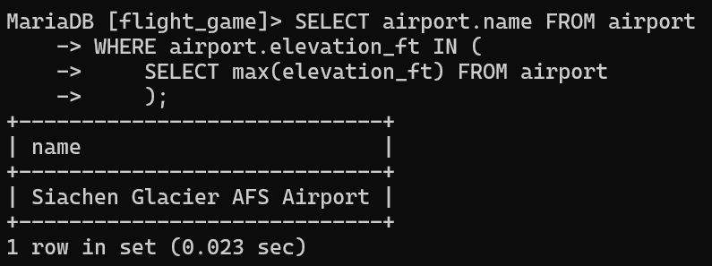
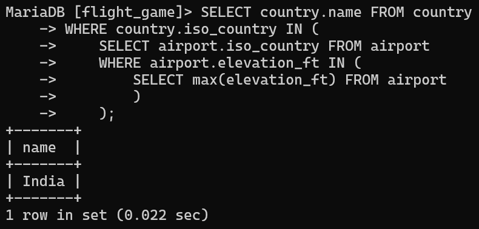
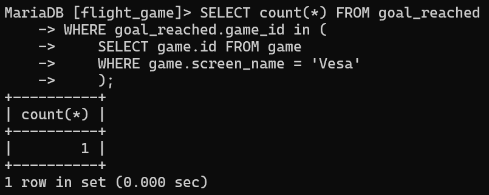
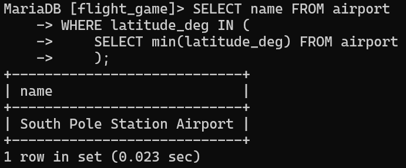

# Exercise 6

## Assignment 1

```sql
SELECT max(elevation_ft) FROM airport;
```


## Assignment 2
```sql
SELECT continent, count(*) from country
GROUP BY continent;
```


## Assignment 3
```sql
SELECT game.screen_name, COUNT(*) from goal_reached
LEFT JOIN game ON game_id = game.id
GROUP BY game.screen_name;
```


## Assignment 4
```sql
SELECT screen_name FROM game
WHERE co2_consumed IN (
    SELECT min(co2_consumed) FROM game
    );
```


## Assignment 5
```sql
SELECT country.name, count(*) FROM airport
LEFT JOIN country ON airport.iso_country = country.iso_country
GROUP BY airport.iso_country 
ORDER BY count(*) desc; 
```


## Assignment 6
```sql
SELECT country.name FROM airport
RIGHT JOIN country ON airport.iso_country = country.iso_country
GROUP BY airport.iso_country
HAVING count(airport.iso_country) >= 1000;
```

## Assignment 7
```sql
SELECT airport.name FROM airport
WHERE airport.elevation_ft IN (
    SELECT max(elevation_ft) FROM airport
    );
```

## Assignment 8
```sql
SELECT country.name FROM country
WHERE country.iso_country IN (
    SELECT airport.iso_country FROM airport
    WHERE airport.elevation_ft IN (
        SELECT max(elevation_ft) FROM airport
        )
    );
```

## Assignment 9
```sql
SELECT count(*) FROM goal_reached
WHERE goal_reached.game_id in (
    SELECT game.id FROM game
    WHERE game.screen_name = 'Vesa'
    );
```

## Assignment 10
```sql
SELECT name FROM airport
WHERE latitude_deg IN (
    SELECT min(latitude_deg) FROM airport
    );
```
