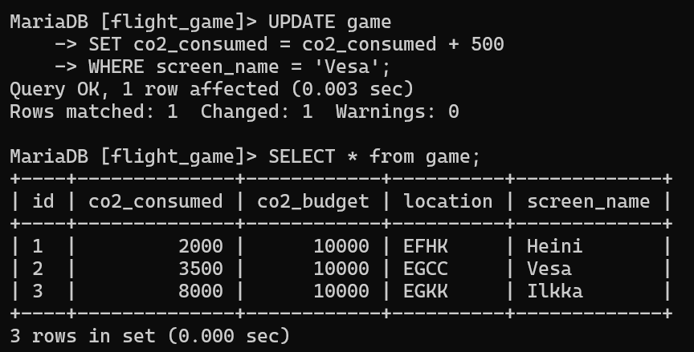
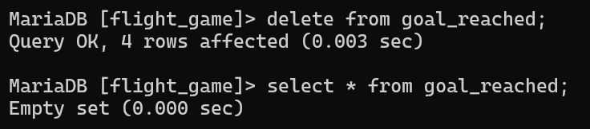
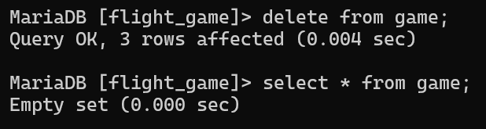

# Exercise 7

## Assignment 1
```sql
UPDATE game
SET co2_consumed = co2_consumed + 500
WHERE screen_name = 'Vesa';
```

## Assignment 2
`Delete from the goal_reached table first`.

## Assignment 3
```sql
DELETE FROM goal_reached
where game_id IN (
    SELECT id FROM game
);
```

## Assignment 4
```sql
DELETE FROM game
WHERE game.id IN (
    SELECT id FROM game
);
```
